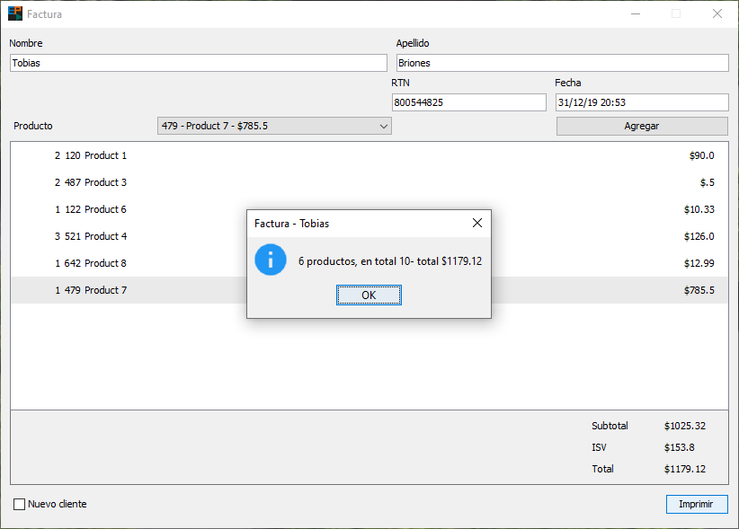
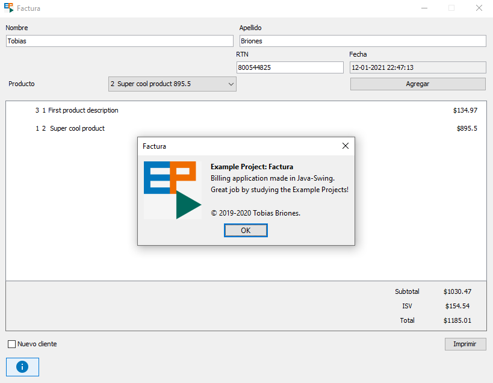

# Example Project: Factura

&nbsp;

Example project for a silly billing application made in Java-Swing.

## Getting started

The project does not have any external dependencies, open the project with you IDE and run it with Java 11+.

### Project structure

In the project's root directory (`./`) there are the following folders:

- **data/**: Contains local data used by the application.

- **res/**: Contains images or resources used by the application.

In the **./src** directory there is the `res` (`./src/res`) top level package with helpers to access the files located
at the directories mentioned above; and the application package `dev.tobiasbriones.ep.factura`.

### Some conventions

I used the suffix "Model" in the domain layer for the Domain Model interfaces so that it may be seen or related to the
"M" from the "MVC" pattern. In a real scenario never suffix or prefix interfaces like this because interfaces define
types and that suffix is noise for the type name you are defining, you may suffix or prefix classes instead if required.
I also used the "Model" suffix just to see a different fashion of the code on this occasion.

### Database package

The [database package](./src/dev/tobiasbriones/ep/factura/database) implements
the [data package](./src/dev/tobiasbriones/ep/factura/data) which contains DAOs (Data Access Objects)
definitions for some domain models. It uses the application's local storage located in the [data folder](./data). In
particular, there is an `InMemoryProductDao` which loads random products into the memory, and also a
`DiskProductDao` to load products in the file stored in the disk, also check `DiskProductDaoTest`.

### Application Configuration

The [AppConfig](./src/dev/tobiasbriones/ep/factura/AppConfig.java) contains the selection of implementations for
the domain models. For example, the `productDao` can be set to be a `DiskProductDao` to load in-disk products rather
than random products since by default it's an `InMemoryProductDao` implementation which is set. This is useful to
decouple the system and inject the dependencies into the UI Components.

### UI package and Components

I wanted to take [v1.0.0](https://github.com/tobiasbriones/ep-factura/releases/tag/v1.0.0) and
refactor this app as something really close to MVC. This is in order to show how MVC works which is the basis for the
other popular architectural patterns (MVP, MVVM). For a real non-basic application never use plain MVC as this pattern
is closer to being a ball of mud (you can see that because it is harder to test). Instead, use MVP with passive View or
MVVM. As mentioned below, I create UI Components and this practice should be followed whenever creating GUIs. The UI
Components even make plain MVC look better designed and more powerful; a great combination is, as I said, using MVP with
passive View and Components instead of just "MVC". The reason is that each part of your "screen" is a component with
meaningful and highly-cohesive encapsulated UI logic.

The [ui package](./src/dev/tobiasbriones/ep/factura/ui) contains the UI Component implementations for the billing
app. To understand each component, it suffices to say that the in-app library used is a set of abstract tools I made
with MVC as a priority and located in the `core` package. Then, each component will have a view that implements the
Swing view (probably JPanel), a controller for the view, and an entry class as a gateway for the component and
assembling it. Each component may have an `Output` for delegating UI logic that may not be implemented in that component
but instead, it should be implemented in a parent component (in order to put UI logic in the appropriate place). The
parent component used here is the
`MainBillingWindow` (a Swing JFrame) and this has a `Mediator` object that takes care of *mediating* among its children
components, that also is, taking care of the children's outputs. Recall that a mediator from the Mediator Pattern is an
object that tends to get bigger and have lower cohesion. If the mediator object has too many responsibilities (the
parent has too many children) then by design principle you have to create a smaller parent to keep it highly cohesive.

## Screenshots

---

---

## Contact

This software: [GitHub Repository](https://github.com/tobiasbriones/ep-factura)

Tobias Briones: [GitHub](https://github.com/tobiasbriones)

Example Project: [App](https://tobiasbriones.github.io/example-project)

## About

**Example Project: Factura**

Example project for a silly billing application made in Java-Swing.

Copyright © 2019-2020 Tobias Briones. All rights reserved.

### License

This project is licensed under the [MIT License](./LICENSE).
